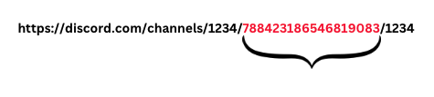

# discord_chat_scraper
Scrapes specified number of recent chats from desired Discord channel

# install requirements
pip install -r requirements.txt

# scraping the messages
 -> Open the Discord Channel in your browser
 -> Start Dev Tools > Network 
 -> Type something in the text area of the chat, you'll notice a new header
 -> Scroll to authorization, copy
 -> Click on any old message on the channel you want to scrape > Copy Link > Copy the channel ID
 
 -> Run python main.py
 -> Proceed as directed